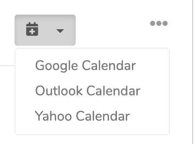

# Add To Calendar

## Example



## Installation

The preferred way to install this extension is through [composer](https://getcomposer.org/download/)

```
$ composer require pixium/yii2-widget-add-to-calendar:dev-master
```

or add

```
"pixium/yii2-widget-add-to-calendar": "dev-master"
```

to the require section of your composer.json file.


### Usage

```
use pixium\widgets\AddToCalendar;

<?= AddToCalendar::widget([
        'label' => '<i class="fas fa-calendar-plus"></i>',
        'text' => 'Title Coach',
        'classes' => 'btn-success',
        'add' => 'xxx@gmail.com',
        'start' => 1234567890,
        'duration' => 60,
        'ctz' => 'Asia/Singapore',
        'details' => 'This session has been planned.',
    ]); 
?>
```

### License

The BSD License (BSD). Please see [License File](LICENSE.md) for more information.
[www.pixiumdigital.com](https://www.pixiumdigital.com)